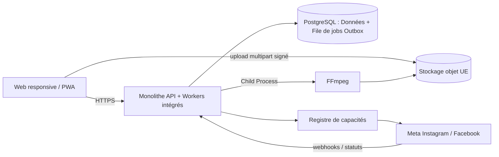
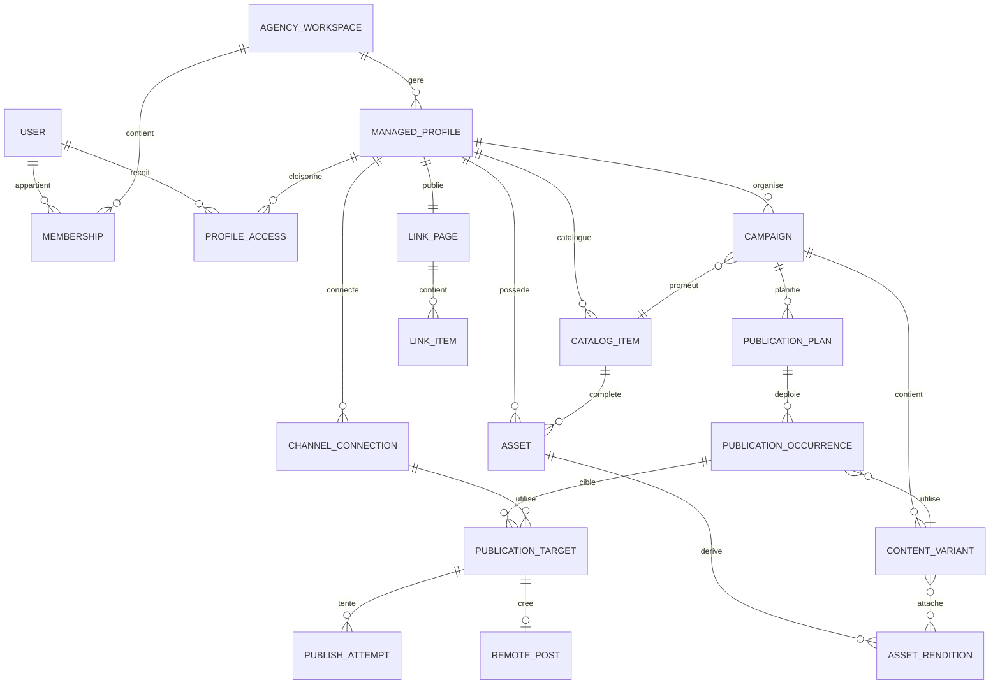
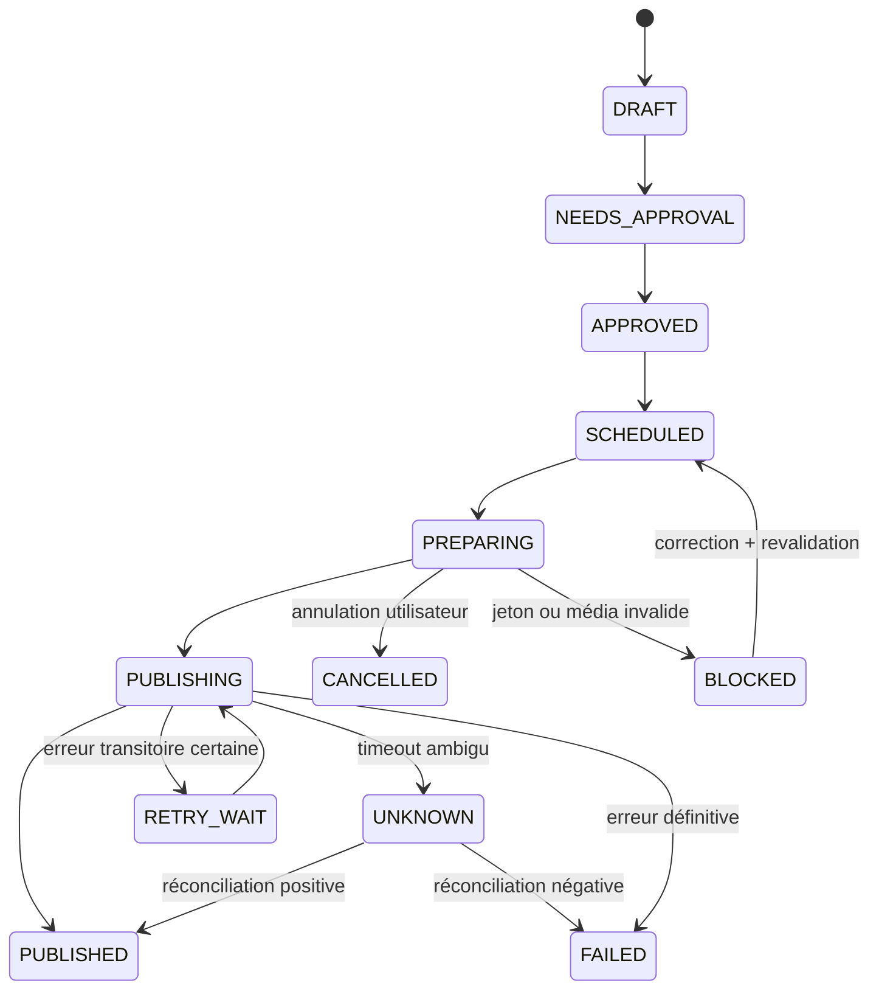

# Architecture technique

## Choix directeur

Construire un **monolithe modulaire** dans un monorepo TypeScript. L'architecture de la V1 (Alpha/Bêta) privilégie la simplicité de déploiement en combinant les processus, avec une base de données servant également de file d'attente. Cela reste évolutif vers un déploiement multi-processus (web, api, workers séparés) lorsque le volume l'exigera.

Stack de référence V1 :

- interface : Next.js, TypeScript, responsive/PWA ;
- API métier : Node.js TypeScript, architecture modulaire, REST documentée ;
- données et jobs : PostgreSQL (ex: via *Graphile Worker* ou *pg-boss*, ce qui élimine Redis en V1) ;
- médias : stockage objet S3-compatible en région UE + CDN pour les rendus publiables ;
- traitement : appels FFmpeg exécutés en processus enfant (*Child Process*) sur le même environnement ;
- observabilité : OpenTelemetry, erreurs centralisées, métriques et alertes ;
- déploiement : une instance unique (PaaS ou VM robuste) contenant le monolithe métier.

Le fournisseur cloud et l'ORM peuvent être choisis après le spike. Le modèle de domaine et les frontières de modules ne doivent pas en dépendre.

## Vue d'ensemble



## Modules

| Module | Responsabilité | Ne doit pas faire |
|---|---|---|
| Agency & Access | agence, création des profils et invitations, droits cloisonnés | autoriser l'agence à publier à la place du propriétaire du profil |
| Managed Profile | profil de type artiste ou lieu, identité, liens et comptes | décider juridiquement des droits musicaux |
| Library | originaux, métadonnées, rendus et conservation | décider du texte |
| Catalog | liens et métadonnées des sorties Spotify/YouTube réutilisables | exiger un fichier pour créer une fiche ou télécharger implicitement une vidéo distante |
| Campaign | scénario métier, calendrier, variantes et validations | appeler directement un réseau |
| Media Adaptation | redimensionnement, recadrage, compression, filigrane CTA et conservation de l'audio | générer du contenu par IA en V1 |
| Scheduler | dates, fuseaux, verrous, outbox | transcoder |
| Publisher | orchestration, reprises, réconciliation, résultats | contenir de logique UI |
| Connectors | OAuth et adaptation à chaque API | modifier le modèle métier central |
| Assisted Publishing | kits manuels, deep links, confirmations et compagnon local | transférer des mots de passe sociaux au backend |
| Analytics | ingestion et normalisation des métriques | devenir un entrepôt analytique dès le MVP |
| Messaging | contacts, consentements, modèles, suppressions | être activé avant le pilote WhatsApp |
| Audit & Compliance | journal, export, suppression, rétention | stocker des secrets en clair |

## Modèle de données minimal



Tables additionnelles V1 : `oauth_credential`, `webhook_event`, `audit_log`, `outbox_event`, `assisted_publication`, `user_confirmation`, `link_page` et `link_item`. Les tables IA (`generation_run`, `prompt_version`) et WhatsApp (`contact`, `contact_source`, `consent_record`, `suppression`, `message_template`, `message_delivery`) appartiennent aux versions futures.

Dans la V1, l'agence peut créer, inviter, suspendre et réinitialiser l'accès d'un profil artiste ou lieu. L'utilisateur propriétaire rattaché au profil charge les images/vidéos et textes, choisit les destinations, planifie, approuve, annule et déclenche ses propres publications. La transition vers `APPROVED` ou `SCHEDULED` doit porter l'identifiant de cet utilisateur ; une action d'administration de l'agence ne peut pas la produire.

La connexion sociale est également une action du propriétaire du profil. Thermidor redirige l'artiste vers l'écran OAuth de Meta ; le mot de passe est saisi chez Meta et n'est jamais visible par l'agence ni par Thermidor. Le backend ne reçoit et ne chiffre que les jetons issus de l'autorisation.

Un `PUBLICATION_PLAN` possède un mode `SINGLE` ou `REPEATED`. Une publication simple utilise `NOW` ou `EXACT_DATETIME`. Plusieurs dates libres utilisent `schedule_mode = MANUAL_DATES`; une répétition utilise `schedule_mode = RECURRENCE_RULE` avec `frequency = DAILY | WEEKLY | MONTHLY`. La règle conserve le fuseau, l'heure locale, les jours de semaine ou le jour du mois selon le cas, et une fin optionnelle (`NEVER`, `UNTIL_DATE`, `OCCURRENCE_COUNT`). Aucun maximum fonctionnel de durée ou d'occurrences n'est imposé en V1. Pour une fréquence mensuelle dont le jour n'existe pas, `monthly_overflow = NEXT_MONTH_FIRST_DAY` place l'occurrence au premier jour du mois suivant, à la même heure locale, sans modifier le jour d'ancrage de la série.

Une récurrence sans fin n'est pas matérialisée intégralement : le scheduler maintient une fenêtre glissante d'occurrences futures, renouvelée périodiquement. Cela évite une infinité de lignes et permet pause, reprise ou modification immédiate sans supprimer l'intention de l'utilisateur. Dans tous les modes, les occurrences restent éditables tant que leur exécution n'a pas commencé. Modifier la règle régénère les occurrences futures encore en état `SCHEDULED`; les occurrences `PREPARING`, `PUBLISHING` ou déjà envoyées ne sont pas réécrites et restent immuables dans l'historique.

L'approbation d'une série ne possède aucune date d'expiration. Elle autorise toutes les occurrences présentes et futures jusqu'à une révocation, une pause ou un arrêt explicite. Comme seul le propriétaire peut modifier et publier, son enregistrement d'une modification de texte, média, destination ou cadence crée une nouvelle révision et met atomiquement à jour `approved_revision_id`, sans écran de réapprobation séparé. Auteur, date et différentiel restent audités. Les contrôles de capacité, de jeton, de média et de politique plateforme sont néanmoins rejoués avant chaque publication.

`CATALOG_ITEM.source_provider` vaut `SPOTIFY` ou `YOUTUBE`. Le seul champ initial obligatoire est `canonical_url`; le résolveur en déduit quand c'est possible `external_id`, le type et un `source_metadata_snapshot` versionné contenant notamment titre, date et visuel d'origine. Les corrections durables sont conservées dans `catalog_item_override`, avec auteur et date de modification ; une pochette de remplacement devient un `ASSET`, sans écraser l'URL source. À la création, `CAMPAIGN_SOURCE_SNAPSHOT` copie les valeurs effectives du catalogue et peut être personnalisé pour cette campagne seulement. Une campagne déjà approuvée ne change donc pas si le catalogue évolue ensuite. Les `ASSET` sont facultatifs pour créer la fiche et correspondent aux fichiers fournis par l'artiste, jamais à des téléchargements implicites depuis Spotify ou YouTube. Une cible Reel exige un `ASSET` vidéo fourni par l'utilisateur et reste `MISSING_MEDIA` sinon ; aucune vidéo n'est générée à partir de la pochette en V1.

Avant programmation, le système recherche les occurrences du même profil, de la même destination et du même contenu dans une fenêtre de 24 heures. Une collision produit un avertissement explicite mais non bloquant. Le choix de continuer est journalisé avec l'utilisateur et la révision concernée.

En V2, `EVENT_INVITATION_SELECTION` conserve les sources choisies par l'utilisateur (`SELECTED_CONTACTS`, `FACEBOOK_FRIENDS`, `PAGE_FOLLOWERS`), les identifiants explicitement sélectionnés lorsque disponibles et un instantané des capacités du compte. Le worker ne tente jamais une source absente de cet instantané et journalise chaque invitation sans importer silencieusement un carnet d'adresses.

Chaque `MANAGED_PROFILE` possède une `LINK_PAGE` publique avec un slug stable. Dans un modèle inspiré de Stan, elle contient photo, nom, biographie courte, liens sociaux et cartes d'action réordonnables. Ses `LINK_ITEM` référencent une campagne, une sortie Spotify/YouTube, une billetterie ou un lien manuel, avec titre, visuel, URL, ordre et état de visibilité. L'activation ou la fin d'une campagne actualise automatiquement les éléments dérivés sans changer l'URL publique. La bio Instagram elle-même n'est pas modifiée par Thermidor ; l'utilisateur y place cette URL une seule fois.

`CAMPAIGN.scenario` vaut `SINGLE_RELEASE`, `ALBUM_RELEASE`, `CONCERT` ou `CATALOG_REVIVAL`. Une campagne de réactivation référence une sortie externe existante et crée de nouvelles publications sociales pointant vers elle, sans repartager ni modifier un ancien post distant. Les campagnes et publications précédentes restent visibles pour éviter une répétition involontaire trop rapprochée.

En V1, une variante est identifiée par le couple `(network, format)`. Toutes les occurrences répétées d'un même couple réutilisent cette variante ; il n'existe pas de personnalisation supplémentaire par date. Par exemple, Instagram Story et Instagram Reel possèdent deux variantes distinctes, tout comme Instagram Reel et Facebook Page Reel.

## Contrat d'un connecteur

Chaque connecteur expose la même surface interne, avec des capacités déclarées plutôt qu'une longue série de conditions dans le code :

```ts
interface PublishingConnector {
  capabilities(account: ConnectedAccount): Promise<Capabilities>;
  validate(draft: PublicationDraft): Promise<ValidationResult>;
  refreshCredential(connectionId: string): Promise<void>;
  uploadMedia(input: Rendition): Promise<RemoteMedia>;
  publish(input: PreparedPublication): Promise<PublishResult>;
  reconcile(attempt: PublishAttempt): Promise<ReconciliationResult>;
  delete?(remotePostId: string): Promise<void>;
  fetchMetrics?(remotePostId: string): Promise<MetricSnapshot>;
}
```

Le registre `Capabilities` est versionné et décrit formats, ratios, durées, taille, champs, type de compte et fonctions disponibles. La validation est exécutée à la création, à l'approbation et juste avant l'envoi, car les règles peuvent changer entre ces moments.

## Cycle d'une publication



Points importants :

- PostgreSQL est la source de vérité ; la file n'est qu'un mécanisme d'exécution.
- L'approbation fige une révision exacte du texte, média et réglages.
- L'annulation ou modification de dernière minute (état `PREPARING`) reste possible et stoppe le job, tant que la requête HTTP n'est pas partie vers le réseau.
- Une clé unique empêche deux jobs actifs pour la même cible et la même révision.
- Les appels internes suivent un modèle au moins une fois ; l'exactement une fois n'est pas garanti par les réseaux.
- Après un timeout ambigu, ne jamais republier aveuglément : passer à `UNKNOWN`, puis rechercher le résultat distant ou demander une décision humaine.
- Les reprises utilisent un délai exponentiel avec jitter et une file d'échecs définitifs.
- La planification est centrale et stockée en UTC, avec le fuseau d'affichage conservé.

## Pipeline média

1. Le navigateur demande un upload multipart signé et envoie directement l'original au stockage objet.
2. L'API crée l'asset en état `UPLOADING`, puis valide taille, type réel et somme de contrôle.
3. Un worker inspecte codecs, durée, dimensions, piste audio séparée ou intégrée et image de couverture.
4. Il normalise l'audio fourni par l'artiste en AAC, l'associe à la vidéo selon les réglages retenus et produit des rendus immuables : vertical 9:16, portrait 4:5, carré 1:1 et miniatures. Pour une Story, il peut ajouter le filigrane CTA « Lien en bio » avant de figer le rendu.
5. Le registre de capacités sélectionne le rendu compatible ; aucun transcodage lourd n'a lieu au moment critique de publication.
6. Les URLs publiques éventuellement requises par une API sont signées, limitées dans le temps et non devinables.

Le MVP offre `remplir`, `ajuster` et un cadrage manuel simple. Le découpage automatique de la vidéo et les sous-titres IA sont des améliorations ultérieures.

## IA hors V1

La V1 ne possède ni fournisseur IA, ni prompt, ni génération de texte, d'image ou de vidéo. L'interface de variantes et le pipeline média restent suffisamment découplés pour ajouter un module IA dans une version future sans modifier le moteur de publication.

Les contrôles V1 portent sur le format du fichier, sa piste audio, la destination choisie et la validation humaine du contenu fourni par le propriétaire du profil.

## Authentification, secrets et sécurité

- OAuth Authorization Code + PKCE lorsque le réseau le supporte ; aucun mot de passe social stocké.
- Jetons chiffrés au repos via KMS, jamais exposés au navigateur ni aux logs.
- Scopes minimaux, état OAuth lié à la session, rotation et révocation testées.
- Séparation logique par `agency_workspace_id` et `managed_profile_id`, contrôlée à chaque requête et testée contre les accès entre profils.
- URLs d'upload courtes, validation MIME par contenu, quotas et scan antimalware.
- Journal d'audit append-only pour connexions, approbations, publications, suppressions et exports.
- Sauvegardes chiffrées, restauration testée et rétention documentée.
- Webhooks signés, idempotents et stockés avant traitement.
- Limitation de débit par agence, artiste, utilisateur, connecteur et credential.

## Destinations sans API (Mode Assisté par Notification)

Les profils/groupes Facebook, WhatsApp personnel et les parcours Spotify non couverts par une API officielle utilisent un parcours strictement assisté :

À l'échéance exacte, un job envoie une notification Web Push au téléphone autorisé (via la PWA obligatoirement installée), sans rappel préalable. Les actions partageant la même fenêtre d'échéance sont regroupées dans un `ACTION_BATCH`; le lien du push ouvre la liste correspondante. Pour chaque `assisted_publication`, un geste utilisateur appelle `navigator.share()` lorsque texte/lien/fichier sont supportés, sinon l'écran fournit copie, téléchargement et ouverture de l'application cible. Après son action dans le réseau, l'utilisateur clique « Marquer comme publié » : ce clic suffit à passer l'état à `CONFIRMED`, avec auteur et horodatage, sans preuve distante obligatoire.

Indépendamment de la livraison du push, toute action arrivée à échéance reste requêtable dans la file persistante `PENDING_USER_ACTION`. Une occurrence récurrente non traitée reste visible jusqu'à l'échéance suivante de la même série ; elle passe alors à `SUPERSEDED`, la nouvelle occurrence devient l'action courante et la série continue normalement. L'utilisateur peut aussi choisir « Ignorer cette publication », ce qui place uniquement l'occurrence en `SKIPPED` sans mettre le plan en pause. Une action ponctuelle reste visible jusqu'au job de clôture mensuel, qui la passe à `EXPIRED`. Les entrées `CONFIRMED`, `SKIPPED`, `SUPERSEDED` et `EXPIRED` quittent la liste active mais restent dans l'historique d'audit. L'email est réservé à une version future.

L'idée d'un "compagnon navigateur" (extension locale) a été abandonnée en raison de sa fragilité et du risque de bannissement de compte (DOM scraping). Le produit ne stocke pas de mot de passe Facebook sur le serveur.

## Données personnelles et conformité

Le service doit être hébergé en région UE par défaut et documenter ses sous-traitants. Prévoir dès le socle : export, suppression, rétention, registre des traitements, accord de sous-traitance et mécanisme de révocation des comptes sociaux.

WhatsApp introduit un niveau supplémentaire : preuve de consentement, liste de suppression, finalité, politique de fréquence et isolation des contacts. Ce module reste désactivé tant que ces éléments ne sont pas livrés et validés juridiquement.

Pour le carnet d'adresses, la synchronisation est `opt-in` : écran système de permission, aperçu des champs, choix de l'espace, confirmation initiale, journal de source et révocation. Une synchronisation automatique ultérieure peut être proposée après cet accord, mais aucune collecte cachée n'est autorisée.

## Observabilité et objectifs initiaux

- corrélation de bout en bout : campagne → cible → job → tentative → appel distant ;
- métriques par connecteur : succès, erreur définitive, timeout, latence, quota, refresh token ;
- alertes sur hausse d'échecs, backlog en retard, webhooks invalides et coûts média/API ;
- tableau support sans accès aux jetons ni aux médias privés non nécessaires ;
- objectif alpha : 99 % des jobs éligibles déclenchés entre l'heure prévue et cinq minutes après, jamais avant ;
- objectif alpha : aucune duplication connue, avec revue obligatoire des états ambigus.

## Web, mobile ou desktop

La PWA couvre le MVP : calendrier, upload depuis téléphone, validation et notifications web. L'upload direct au stockage évite de faire transiter de grandes vidéos par le serveur web. Le périmètre étendu peut ajouter une extension de navigateur, considérée comme un client local du produit et non comme une application desktop complète.

Une application mobile native ne devient justifiée que si les tests montrent un besoin répété de capture/import depuis la photothèque, d'upload résilient en arrière-plan, de notifications push critiques ou d'intégration à la feuille de partage. Une application desktop n'apporte pas de valeur métier propre ; les traitements lourds restent côté serveur.
